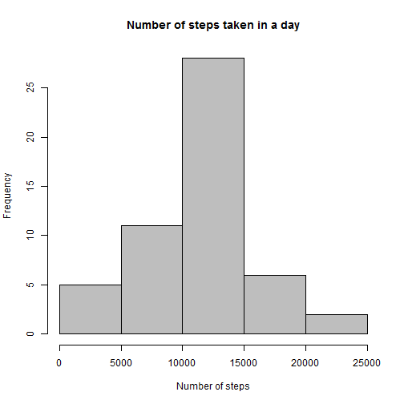
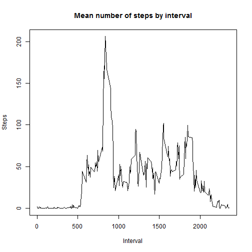
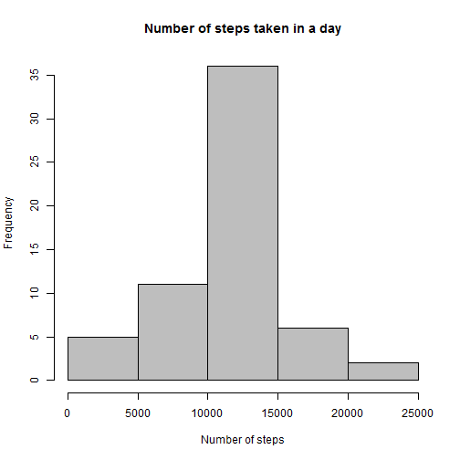
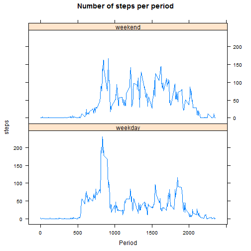

Peer Assignment 1 - Analysis
========================================================


### Loading and preprocessing the data
To run the analysis for this project, the first step is to read the file activity.csv originaly avaluable in this [link](https://d396qusza40orc.cloudfront.net/repdata%2Fdata%2Factivity.zip). This version of the data was downloaded in 06 12 2014. The code used to read the data is:

```r
data = read.csv("activity.csv")
```


The raw data has the following structure:

```r
str(data)
```

```
## 'data.frame':	17568 obs. of  3 variables:
##  $ steps   : int  NA NA NA NA NA NA NA NA NA NA ...
##  $ date    : Factor w/ 61 levels "2012-10-01","2012-10-02",..: 1 1 1 1 1 1 1 1 1 1 ...
##  $ interval: int  0 5 10 15 20 25 30 35 40 45 ...
```


I'm a Portuguese native speaker, so the dates language configuration has to be changed to english. The code below does that, as well as the transformations needed to the analysis


```r
Sys.setlocale("LC_TIME", "English")
```

```
## [1] "English_United States.1252"
```

```r
day = strptime(as.character(data[, 2]), "%Y-%m-%d")
wday = weekdays(day)
steps = data[, 1]
interval = data[, 3]
tidy = data.frame(day, wday, steps, interval)
```


### What is mean total number of steps taken per day?

Now we are ready to study the data. The first thing is to find total number of steps taken per day

```r
step.day = aggregate(tidy$steps ~ day, data = tidy, FUN = sum)[, 1:2]
hist(step.day[, 2], xlim = c(0, 25000), xlab = "Number of steps", main = "Number of steps taken in a day", 
    col = "grey")
```

 

```r
mean(step.day[, 2])
```

```
## [1] 10804
```

```r
median(step.day[, 2])
```

```
## [1] 10890
```


### What is the average daily activity pattern?

To understand daily activity pattern we can use the following code:

```r
step.interval = aggregate(tidy$steps ~ interval, data = tidy, FUN = mean)
names(step.interval) = c("intervals", "steps")
plot(step.interval$interval, step.interval$steps, type = "l", xlab = "Interval", 
    ylab = "Steps", main = "Mean number of steps by interval")
```

 

```r
max.steps = max(step.interval$steps)
int.max.steps = step.interval$interval[which.max(step.interval$steps)]
```

The time series plot shows that the mean number of steps taken in the intervals of 750 and 1000 minutes are very high. In particular at the interval of 835 we can see that we have a mean of 206.1698 steps.

### Imputing missing values

Now we should understand the missing data. To count how many missing counts of steps we have, we can do the following.

```r
missings = is.na(steps)
sum(missings)
```

```
## [1] 2304
```

So, we know that 2304 of the 17568 registers have missing data. Now we have to imput the missing values. For each missing number of steps we use the mean number of steps for the respective interval


```r
NewData = tidy
for (i in 1:dim(NewData)[1]) {
    if (is.na(NewData$steps[i])) {
        for (j in 1:dim(step.interval)[1]) {
            if (NewData$interval[i] == step.interval[j, 1]) {
                NewData$steps[i] = step.interval[j, 2]
            }
        }
    }
}
```


Now with a new data set with no missing values, we can analyse agains the histogram.

```r
n.step.day = aggregate(NewData$steps ~ day, data = NewData, FUN = sum)[, 1:2]
hist(n.step.day[, 2], xlim = c(0, 25000), xlab = "Number of steps", main = "Number of steps taken in a day", 
    col = "grey")
```

 

```r
mean(n.step.day[, 2])
```

```
## [1] 10799
```

```r
median(n.step.day[, 2])
```

```
## [1] 10766
```


We can see that there is no significative change in the histogram and the mean and median have minor changes.

### Are there differences in activity patterns between weekdays and weekends?
 
 The first thig we will have to do is to create a new column that indicates if it is a weekday or weekend. We can do that with this code.
 


```r
kday = wday
for (i in 1:length(wday)) {
    if (wday[i] %in% c("Saturday", "Sunday")) {
        kday[i] = "weekend"
    } else {
        kday[i] = "weekday"
    }
}
NewData = cbind(NewData, kday)
step.interval.day = aggregate(NewData$steps ~ NewData$interval + NewData$kday, 
    data = NewData, FUN = mean)
names(step.interval.day) = c("interval", "kday", "steps")
```


To make this graph, we will use the lattice library, this code loads the library and makes the graph

```r
library(lattice)
xyplot(steps ~ interval | kday, data = step.interval.day, type = "l", main = "Number of steps per period", 
    xlab = "Period", layout = c(1, 2))
```

 


We can see that they pattern is different, during the weekdays the steps seem to be more concentrated in a small interval of the day.
